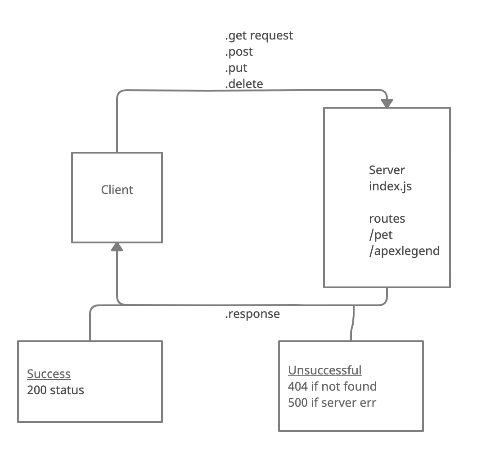

# basic-api-server

## Current LAB - 03

## Express REST API

Build a REST API using Express, by creating a proper series of endpoints that perform CRUD operations on a database, using the REST standard.

### Author: Mark Thanadabouth

### Collaborators: Alex W(Instructor), Heather B, Charlie F, Jeremy B, Phil M

#### Links and Resources
* [Deployed Link (devBranch)](https://markt-basic-api-server-dev.herokuapp.com/)
* [Deployed Link (mainBranch)](https://mt-basic-api-server-prod.herokuapp.com/)

### Setup

#### `.env` requirements
- `PORT` - Port Number

#### Running App
- `npm start` or `npx nodemon`

Endpoints:
- `/`
> Hello Main Server
- `/pet`
> Returns 'pet' object
- `/apexlegend`
> Returns 'apex character' object

#### Tests
- `npm test`

### UML
> 

### Reflections and Comments
* Start date (10/02)

### LAB - 03

Name of feature: Express REST API

Estimate of time needed to complete: 6 Hours

Start time: 2pm(10/2)

Finish time: 7pm(10/4)

Actual time needed to complete: 8 hours
